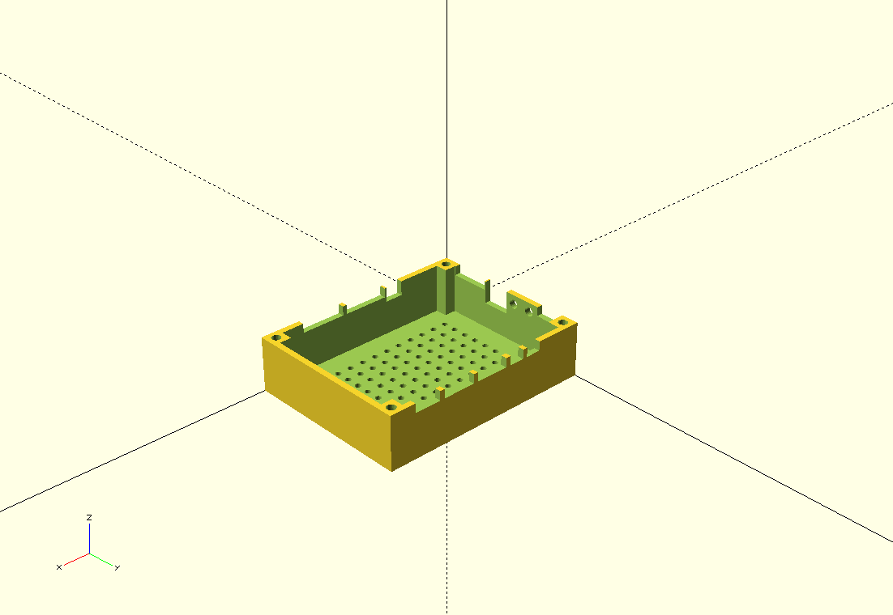

# 3DModels

## Introduction
There including some interesting 3D models designed by OpenSCAD,we can directly transfer these 3D models files (STL format) to 3D printer to get our targets 
## Running Enviorment
### ubuntu
> sudo apt-get install openscad
## 3D Models Examples 
### PCB_Box

### SoundBar

### BayMax(Reference)

